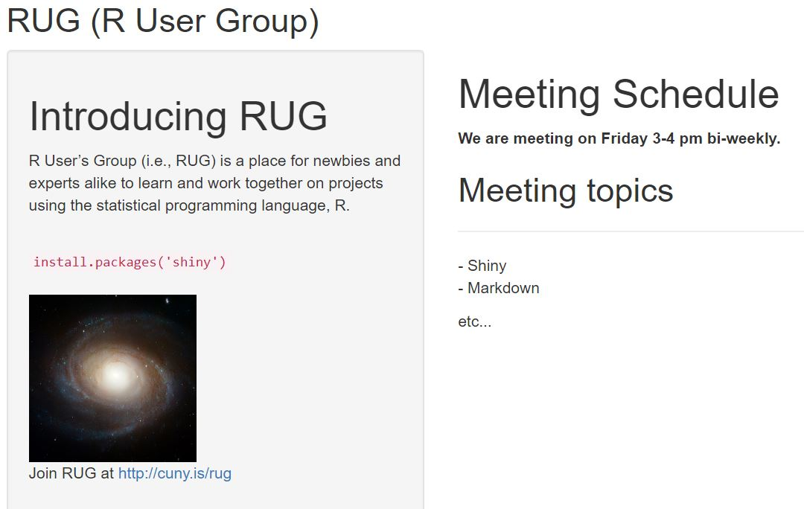

```{r setup, include=FALSE}
knitr::opts_chunk$set(echo = TRUE)
```

## Shiny apps

Shiny apps are contained in a single script called `app.R`. `app.R` has 3 components:

-   a user interface object
-   a server function
-   a call to the `shinyApp` function, `shinyApp(ui, server)`

The script `app.R` lives in a directory (for example, `newdir/`) and the app can be run with `runApp("newdir")`.

Let's see what Shiny apps we have in the directory.

```{r runShiny}
library(shiny)
list.files()
```

To run the app of `Hello_World`.

```{r runHelloWorld, eval = FALSE}
runApp('Hello_World')
```

There are other code examples in Shiny.

```{r ShinyExamples, eval = FALSE}
# Some examples in Shiny
runExample("01_hello")      # a histogram
runExample("02_text")       # tables and data frames
runExample("03_reactivity") # a reactive expression
runExample("04_mpg")        # global variables
runExample("05_sliders")    # slider bars
runExample("06_tabsets")    # tabbed panels
runExample("07_widgets")    # help text and submit buttons
runExample("08_html")       # Shiny app built from HTML
runExample("09_upload")     # file upload wizard
runExample("10_download")   # file download wizard
runExample("11_timer")      # an automated timer
```

A framework of the Shiny app.

```{r framework, eval = FALSE}
# define UI ---
ui <- fluidPage(
  
)

# define server logic --- 
server <- function(input, output){
  
}

# run the app --- 
shinyApp(ui = ui, server = server)

# result: blank user interface
```

The result of the code is a blank user interface.

## Let's add some elements

### `sidebarLayout` for layout design

These functions place content in either the sidebar or the main panels.

`sidebarLayout` has two arguments:

-   `sidebarPanel` function output
-   `mainPanel` function output

You can move the sidebar panel to the right side by giving `sidebarLayout` the optional argument: `position = "right"`

`titlePanel` and `sidebarLayout` create basic layout. `navbarPage` can provide a multi-page user interface that includes a navigation bar. You can also use `fluidRow` and `column` to build layout from a grid system. Those advanced options can be found in the [Shiny Application Layout Guide](https://shiny.rstudio.com/articles/layout-guide.html).

### HTML content

We can use HTML tag functions in Shiny, which are parallel common HTML5 tags.

**shiny function HTML5 equivalent creates**

|        |            |                                                  |
|:------:|:----------:|:------------------------------------------------:|
|   p    |   `<p>`    |               A paragraph of text                |
|   h1   |   `<h1>`   |               A first level header               |
|   h2   |   `<h2>`   |              A second level header               |
|   h3   |   `<h3>`   |               A third level header               |
|   h4   |   `<h4>`   |              A fourth level header               |
|   h5   |   `<h5>`   |               A fifth level header               |
|   h6   |   `<h6>`   |               A sixth level header               |
|   a    |   `<a>`    |                   A hyper link                   |
|   br   |   `<br>`   |         A line break (e.g. a blank line)         |
|  div   |  `<div>`   |     A division of text with a uniform style      |
|  span  |  `<span>`  | An in-line division of text with a uniform style |
|  pre   |  `<pre>`   |        Text ‘as is’ in a fixed width font        |
|  code  |  `<code>`  |            A formatted block of code             |
|  img   |  ``   |                     An image                     |
| strong | `<strong>` |                    Bold text                     |
|   em   |   `<em>`   |                 Italicized text                  |
|  HTML  |            | Directly passes a character string as HTML code  |

#### Headers

We first create a header element and then pass it as an argument to `titlePanel`, `sidePanel`, or `mainPanel`.

```{r header1}
h1("My first header")
# <h1>My title</h1>
```

Let's try to use six levels of headers. Then, we can update ui.R to match the script and then relaunch the app `runApp('user_interface)`.

```{r header2, eval= FALSE}
ui <- fluidPage(
  titlePanel('My first shiny app'),
  
  sidebarLayout(
    position = 'right'
    sidebarPanel('Sidebar Panel'),
    mainPanel(
      h1("First level title"),
      h2("Second level title"),
      h3("Third level title"),
      h4("Fourth level title"),
      h5("Fifth level title"),
      h6("Sixth level title")
    )
  )
)

# run the udpated app
runApp('user_interface')
```

In general, any HTML tag attribute can be set as an argument in any Shiny tag function. We can find the HTML tag attributes in many free online HTML resources such as [w3schools](https://www.w3schools.com/tags/tag_hn.asp).

For example, we can update the user interface and make it a Star Was-inspired user interface:

```{r starwar, eval = FALSE}
ui <- fluidPage(
  titlePanel("My Star Wars App"),
  sidebarLayout(
    sidebarPanel(),
    mainPanel(
      h6("Episode IV", align = "center"),
      h6("A NEW HOPE", align = "center"),
      h5("It is a period of civil war.", align = "center"),
      h4("Rebel spaceships, striking", align = "center"),
      h3("from a hidden base, have won", align = "center"),
      h2("their first victory against the", align = "center"),
      h1("evil Galactic Empire.")
    )
  )
)
```

#### Formatted text

Shiny offers many tag functions for formatting text, same as the HTML tags. Let's try to write an example with formatted text. 

```{r formatted_text, eval=FALSE}
ui <- fluidPage(
  titlePanel("My Shiny App"),
  sidebarLayout(
    sidebarPanel(
      strong("This is the sidebar Panel"),
      p("Main panel shows the instruction on formatted text.")
      
    ),
    mainPanel(
      p("p creates a paragraph of text."),
      p("A new p() command starts a new paragraph. Supply a style 
      attribute to change the format of the entire paragraph.", 
        style = "font-family: 'times'; font-sil16pt; font-size:30px"),
      strong("strong() makes bold text."), 
      em("em() creates italicized (i.e, emphasized) text."), 
      br(),
      code("code displays your text similar to computer code"),
      div("div creates segments of text with a similar style. This division
          of text is all blue because I passed the argument 
          'style = color:blue' to div", style = "color:blue"),
      br(),
      p("span does the same thing as div, but it works with",
        span("groups of words", style = "color:blue"),
        "that appear in side a paragraph.")
    )
  )
)
```


#### Images

Shiny looks for the `img` function to place image files in your app. To insert an image, give the `img` function the name of your image file as the `src` argument (e.g., `img(src = "my_image.png"))`. You must spell out this argument since `img` passes your input to an HTML tag, and `src` is what the tag expects.

The `img` function looks for your image file in a specific place. Your file must be in a folder named `www`, which should be placed in the same directory of that Shiny app. Shiny treats this directory in a special way. While you don't need to specify the folder path as `"/www/my_image.png"`, just leave it as `my_image.png` should work.

You can also include other HTML friendly parameters such as height and width. Note that height and width numbers will refer to pixels.

```{r image, eval = FALSE}
img(src = "my_image.png", height = 72, width = 72)
```

### Other tags

There are many more tag functions for your to use. You can learn about the additional tag functions in [Customize your UI with HTML](https://shiny.rstudio.com/articles/html-tags.html) and [Shiny HTML Tags Glossary](https://shiny.rstudio.com/articles/tag-glossary.html).

### Exercise 1

Let's try to make a a shiny App looks like the following picture: 


```{r Exercise1, eval=FALSE}
ui <- fluidPage(
  titlePanel("RUG (R User Group)"),
  sidebarLayout(
    sidebarPanel(
      p("R User’s Group (i.e., RUG) is a place for newbies and experts 
        alike to learn and work together on projects using the 
        statistical programming language, R.")
    ),
    mainPanel(
      h1("Meeting Schedule"),
      strong("We are meeting on Friday 3-4 pm bi-weekly."),
      h2("Meeting topics"),
      hr("- Shiny"), p("- Markdown"), p("etc...") 
    )
  )
)
```


### Add control widgets

This lesson will show you how to add control widgets to your Shiny apps.
Widgets provide a way for your users to send messages to the Shiny app.
Shiny widgets collect a value from your user. When a user changes the widget, the value will change as well. Shiny comes with a family of 
pre-build widgets, each created with a transparently named R function. 
For example, Shiny provides a function named `actionButton` that creates an Action Button and a function named `sliderInput` that creates a slider bar.

The standard Shiny widgets are:

| function           | widget                                         |
|--------------------|------------------------------------------------|
| actionButton       | Action Button                                  |
| checkboxGroupInput | A group of check boxes                         |
| checkboxInput      | A single check box                             |
| dateInput          | A calendar to aid date selection               |
| dateRangeInput     | A pair of calendars for selecting a date range |
| fileInput          | A file upload control wizard                   |
| helpText           | Help text that can be added to an input form   |
| numericInput       | A field to enter numbers                       |
| radioButtons       | A set of radio buttons                         |
| selectInput        | A box with choices to select from              |
| sliderInput        | A slider bar                                   |
| submitButton       | A submit button                                |
| textInput          | A field to enter text                          |

#### Adding widgets

You can add widgets to your web page in the same way that you added other types of HTML content. To add a widget to your app, place a widget function in `sidebarPanel` or `mainPanel` in your ui object.

Each widget function requires several arguments. The first two arguments for each widget are:

- a name for the widget: The user will not see this name, but you can use it to access the widget’s value. The name should be a character string.

- a label: This label will appear with the widget in your app. It should be a character string, but it can be an empty string "".

In this example, the name is “action” and the label is “Action”: `actionButton("action", label = "Action")`

The app.R script below makes the app pictured above. Change your own `widgetPractice/app.R` script to match it, and then launch the app (runApp("widgetPractice"), select Run App, or use shortcuts).

Play with each widget to get a feel for what it does. Experiment with changing the values of the widget functions and observe the effects. If you are interested in the layout scheme for this Shiny app, read the description in the [application layout guide](https://shiny.rstudio.com/articles/layout-guide.html).

```{r widgets, eval=FALSE}
ui <- fluidPage(
  titlePanel("Basic widgets"),
  
  fluidRow(
    
    column(3,
           h3("Buttons"),
           actionButton("action", "Action"),
           br(),
           br(), 
           submitButton("Submit")),
    
    column(3,
           h3("Single checkbox"),
           checkboxInput("checkbox", "Choice A", value = TRUE)),
    
    column(3, 
           checkboxGroupInput("checkGroup", 
                              h3("Checkbox group"), 
                              choices = list("Choice 1" = 1, 
                                             "Choice 2" = 2, 
                                             "Choice 3" = 3),
                              selected = 1)),
    
    column(3, 
           dateInput("date", 
                     h3("Date input"), 
                     value = "2014-01-01"))   
  ),
  
  fluidRow(
    
    column(3,
           dateRangeInput("dates", h3("Date range"))),
    
    column(3,
           fileInput("file", h3("File input"))),
    
    column(3, 
           h3("Help text"),
           helpText("Note: help text isn't a true widget,", 
                    "but it provides an easy way to add text to",
                    "accompany other widgets.")),
    
    column(3, 
           numericInput("num", 
                        h3("Numeric input"), 
                        value = 1))   
  ),
  
  fluidRow(
    
    column(3,
           radioButtons("radio", h3("Radio buttons"),
                        choices = list("Choice 1" = 1, "Choice 2" = 2,
                                       "Choice 3" = 3),selected = 1)),
    
    column(3,
           selectInput("select", h3("Select box"), 
                       choices = list("Choice 1" = 1, "Choice 2" = 2,
                                      "Choice 3" = 3), selected = 1)),
    
    column(3, 
           sliderInput("slider1", h3("Sliders"),
                       min = 0, max = 100, value = 50),
           sliderInput("slider2", "",
                       min = 0, max = 100, value = c(25, 75))
    ),
    
    column(3, 
           textInput("text", h3("Text input"), 
                     value = "Enter text..."))   
  )
  
)
```


